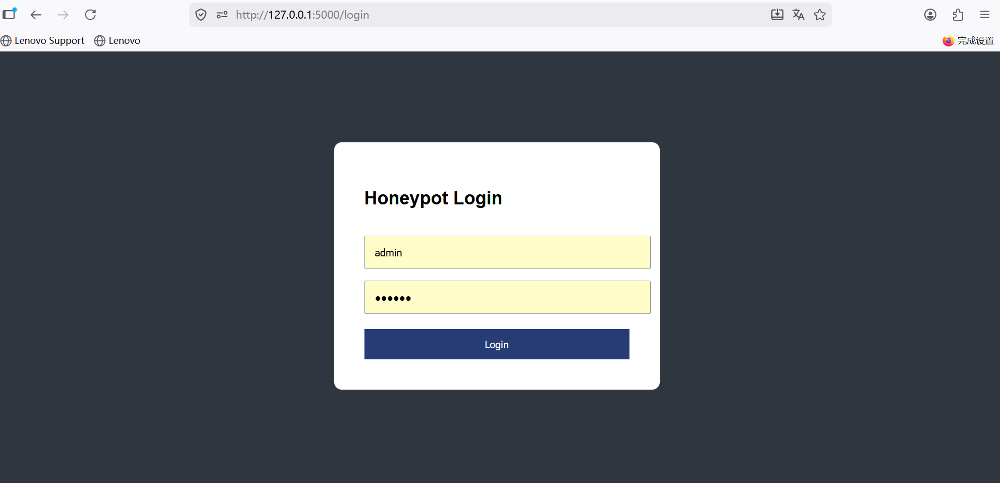
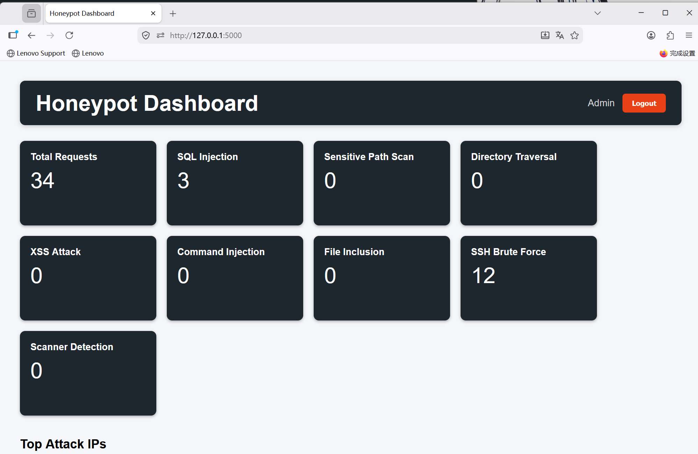
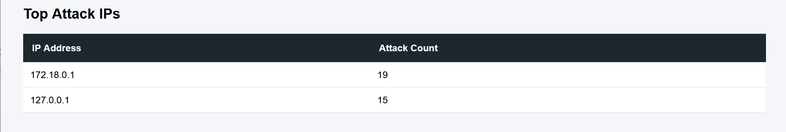
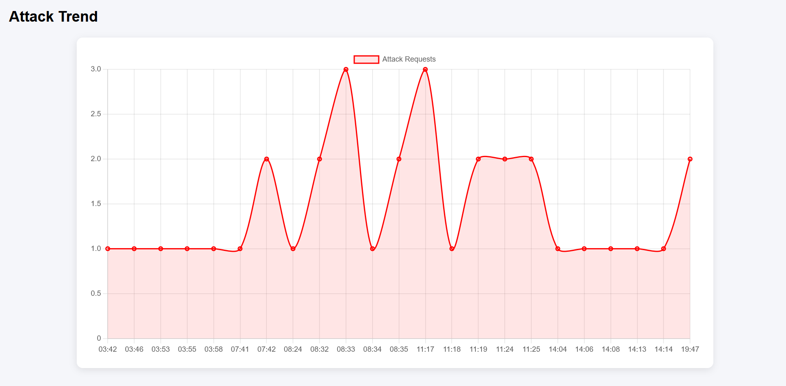
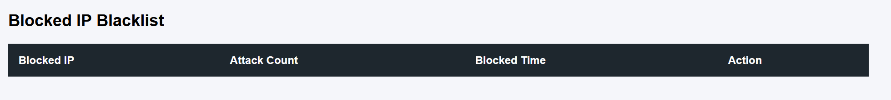
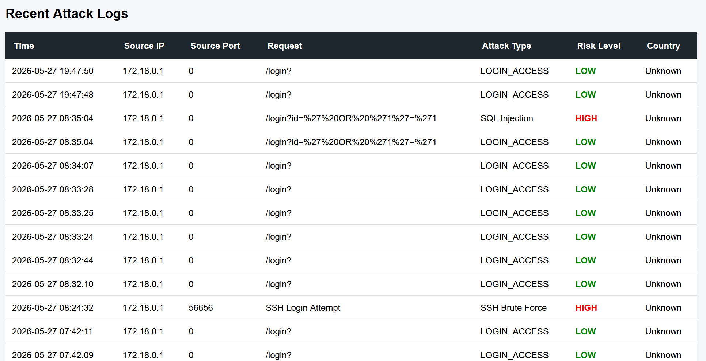
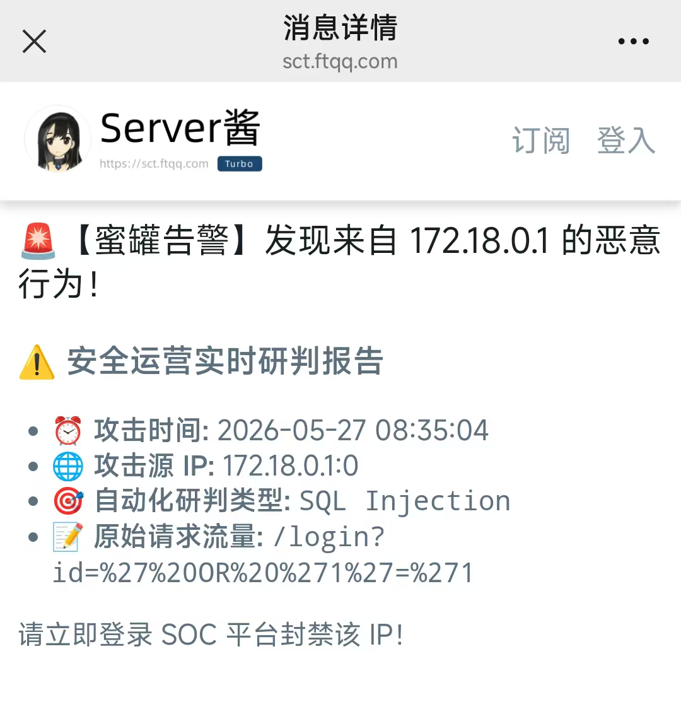

# ThreatTrap

轻量级网络安全蜜罐与攻击监控平台（Lightweight Honeypot & Attack Monitoring Platform）

---

## 项目简介

ThreatTrap 是一个基于 Python + Flask 开发的轻量级网络安全蜜罐平台，能够模拟 Web 与 SSH 服务，对常见网络攻击行为进行检测、日志记录、告警推送与自动封禁。

项目支持：

- SQL Injection 检测
- XSS 攻击检测
- Directory Traversal 检测
- Command Injection 检测
- SSH 暴力破解监控
- GeoIP 国家识别
- 微信实时告警
- Docker 容器化部署
- 攻击趋势统计与可视化

适用于：

- 网络安全学习
- 攻击流量分析
- 安全开发实践
- Honeypot 技术研究

---

# 项目架构

```text
Attacker
   │
   ▼
Honeypot Service
(Web + SSH)
   │
   ├── Traffic Analysis
   ├── Attack Detection
   ├── Auto Blocking
   ├── GeoIP Analysis
   └── WeChat Alert
   │
   ▼
SQLite Database
   │
   ▼
Flask Dashboard

功能特性
Web 攻击检测

支持检测：

SQL Injection
XSS Attack
Command Injection
File Inclusion
Directory Traversal
Sensitive Path Scan
Scanner Detection
SSH 蜜罐

模拟 OpenSSH Banner：

SSH-2.0-OpenSSH_8.2p1 Ubuntu-4ubuntu0.5

支持：

SSH 暴力破解检测
登录行为记录
自动告警
自动封禁
自动封禁机制

当攻击 IP 超过阈值时：

自动加入黑名单
Dashboard 实时展示
阻止后续访问
GeoIP 国家识别

基于 MaxMind GeoLite2 数据库：

自动识别攻击来源国家
支持 Dashboard 展示
微信实时告警

检测到高危攻击时：

自动发送企业微信通知
实时推送攻击信息
Dashboard 功能

支持：

实时攻击日志
TOP 攻击 IP
攻击趋势图
黑名单管理
风险等级展示
GeoIP 国家统计

技术栈
| 技术       | 说明            |
| -------- | ------------- |
| Python   | 核心开发语言        |
| Flask    | Web Dashboard |
| SQLite   | 日志存储          |
| Socket   | 蜜罐监听          |
| Docker   | 容器化部署         |
| GeoIP2   | 国家识别          |
| Chart.js | 数据可视化         |

Docker 部署
1. 克隆项目
git clone https://github.com/yourname/ThreatTrap.git
cd ThreatTrap
2. 启动服务
docker-compose up --build
3. 访问 Dashboard
http://127.0.0.1:5000
SSH 测试
ssh root@127.0.0.1 -p 2222

项目截图
## Login Page



## Dashboard



## Top Attack IPs



## Attack Trend



## Blocked IP Blacklist



## Recent Attack Logs



## WeChat Alert



项目亮点
基于 Socket 实现轻量级蜜罐系统
支持 Web + SSH 双协议监控
Docker 容器化部署
支持 GeoIP 攻击来源分析
支持企业微信实时告警
支持自动封禁恶意 IP
支持攻击行为可视化分析
后续优化方向
Redis 实时缓存
WebSocket 实时日志推送
ELK 日志分析
威胁情报联动
攻击地图可视化
AI 异常流量识别
